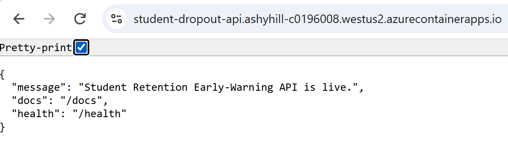
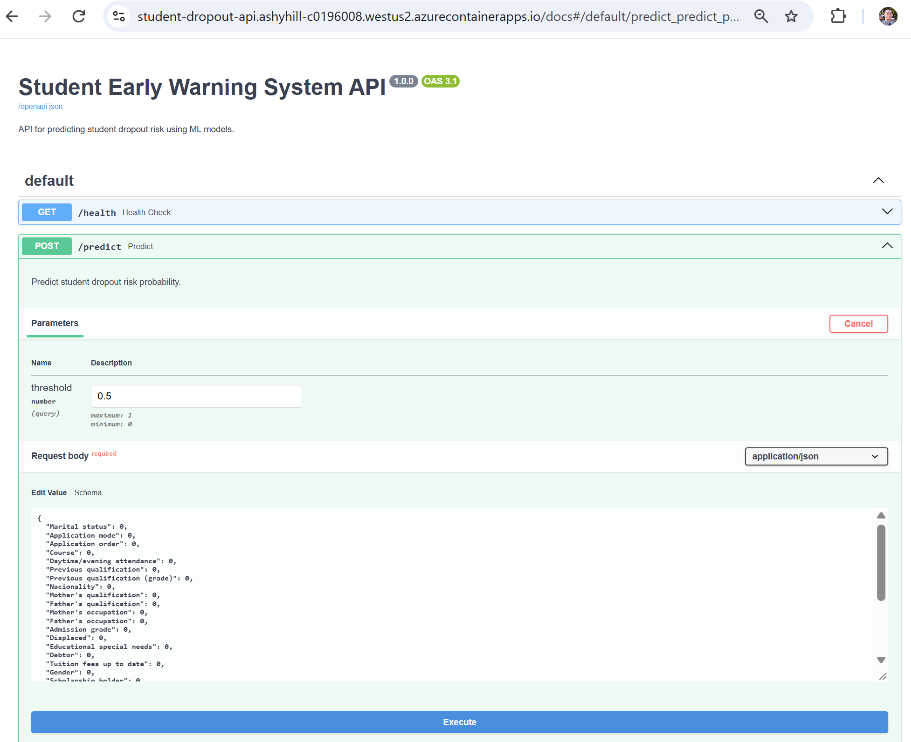
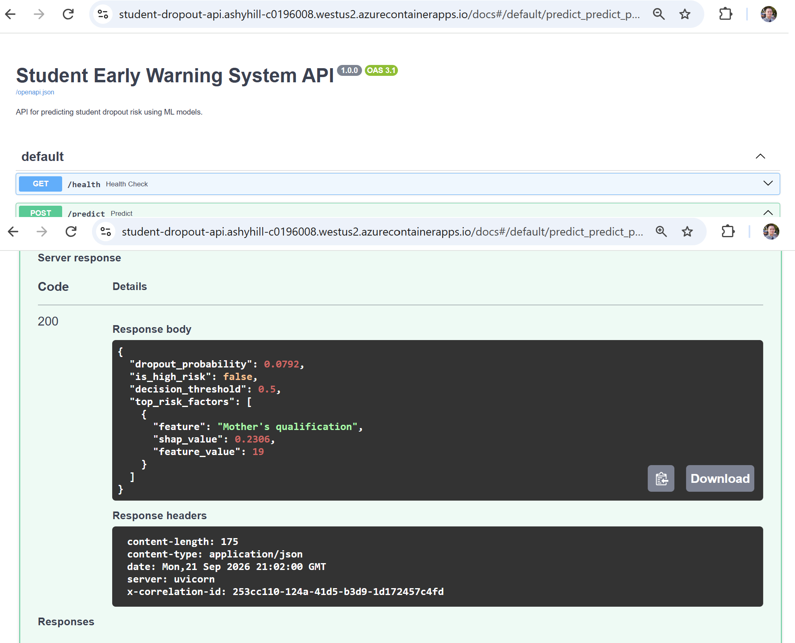

# Student Retention ML Pipeline

End-to-end MLOps pipeline predicting student dropout risk using the UCI dataset. Features a scikit-learn training pipeline, MLflow experiment tracking, SHAP explainability with a subgroup fairness audit, automated GitHub Actions CI/CD, and a containerized FastAPI REST API deployed to Azure Container Apps.

---

## System Showcase

### Live API Landing & Interactive Documentation

| Root Landing Endpoint (`/`) | Interactive Swagger UI (`/docs`) |
| :---: | :---: |
|  |  |

### Live Model Inference & SHAP Explainability (`POST /predict`)



---

## Cloud Endpoints

* **Live API Base URL**: [https://student-dropout-api.ashyhill-c0196008.westus2.azurecontainerapps.io](https://student-dropout-api.ashyhill-c0196008.westus2.azurecontainerapps.io)
* **Swagger OpenAPI Specs**: [https://student-dropout-api.ashyhill-c0196008.westus2.azurecontainerapps.io/docs](https://student-dropout-api.ashyhill-c0196008.westus2.azurecontainerapps.io/docs)
* **Health Check**: [https://student-dropout-api.ashyhill-c0196008.westus2.azurecontainerapps.io/health](https://student-dropout-api.ashyhill-c0196008.westus2.azurecontainerapps.io/health)

---

## Project Structure

```
4-student-retention-ml-pipeline/
├── .github/
│   └── workflows/
│       └── ci.yml                          # Continuous Integration (linting, tests, coverage)
├── api/
│   ├── __init__.py
│   └── main.py                             # FastAPI app with /predict & /health endpoints
├── assets/                                 # README images (landing page, Swagger UI, prediction response)
├── data/
│   ├── raw/
│   │   └── data.csv                        # Raw UCI dataset
│   └── processed/
│       ├── student_data_early_warning.csv  # Filtered 1st-semester-only feature set
│       └── student_data_full.csv           # Full processed dataset
├── models/
│   └── early_warning_pipeline.joblib       # Exported inference pipeline artifact
├── notebooks/
│   └── data_exploration.ipynb              # Exploratory data analysis & initial SHAP experiments
├── src/
│   ├── __init__.py
│   ├── load_data.py                        # Ingestion & data leakage boundary definition
│   └── train_pipeline.py                   # scikit-learn Pipeline & MLflow tracking
├── tests/
│   ├── conftest.py                         # Test fixtures
│   └── test_api.py                         # Pytest suite for API endpoints and validation
├── .dockerignore
├── .gitignore
├── Dockerfile                              # Multi-stage production container configuration
├── LICENSE                                 # Repository license
├── mlflow.db                               # Local MLflow tracking store
├── notes.md                                # Development notes
├── pyproject.toml                          # Ruff and Pytest configurations
├── README.md                               # Project documentation
├── requirements.txt                        # Production dependencies
└── requirements-dev.txt                    # Development and testing dependencies
```

> Generated/local-only folders (`.pytest_cache`, `.ruff_cache`, `.vscode`, `__pycache__`, `htmlcov`, `mlruns`, `venv`, `.coverage`) are omitted above since they're build artifacts rather than source, and should stay in `.gitignore`.

---

## Key Features & Architecture

* **Data Leakage Safeguards**: Strict temporal splitting ensuring 2nd-semester variables are excluded to maintain an authentic early-warning window (1st-semester evaluation phase).
* **MLflow Tracking**: Complete tracking of model parameters, metrics (ROC-AUC, F1-Score, Precision, Recall), and serialized pipeline artifacts.
* **Explainability & Fairness**: Local and global SHAP (SHapley Additive exPlanations) values coupled with demographic subgroup audits (gender, age at enrollment, scholarship status).
* **Automated CI Pipeline**: Automated unit testing, code linting (Ruff), and coverage reporting via GitHub Actions.
* **Cloud Infrastructure**: Azure Container Registry (ACR) hosting dockerized images served on serverless Azure Container Apps.

---

## Quickstart & Usage

### 1. Local Setup

Clone the repository and set up your virtual environment:

```bash
git clone https://github.com/kellycheung5-collab/4-student-retention-ml-pipeline.git
cd 4-student-retention-ml-pipeline
python -m venv venv
source venv/bin/activate  # On Windows: .\venv\Scripts\Activate.ps1
pip install -r requirements.txt -r requirements-dev.txt
```

### 2. Run Tests & Pipeline

Execute the test suite and train the pipeline locally:

```bash
pytest
python src/train_pipeline.py
```

### 3. Launch Local REST API

Start the FastAPI development server:

```bash
uvicorn api.main:app --reload --port 8000
```

### 4. Sample REST API Request

Send an inference request to the live Azure endpoint using PowerShell:

```powershell
$URL = "https://student-dropout-api.ashyhill-c0196008.westus2.azurecontainerapps.io/predict"

$Body = @{
    "Marital status" = 1
    "Application mode" = 17
    "Application order" = 1
    "Course" = 9254
    "Daytime/evening attendance" = 1
    "Previous qualification" = 1
    "Previous qualification (grade)" = 122.0
    "Nacionality" = 1
    "Mother's qualification" = 19
    "Father's qualification" = 37
    "Mother's occupation" = 5
    "Father's occupation" = 9
    "Admission grade" = 127.3
    "Displaced" = 1
    "Educational special needs" = 0
    "Debtor" = 0
    "Tuition fees up to date" = 1
    "Gender" = 1
    "Scholarship holder" = 0
    "Age at enrollment" = 20
    "International" = 0
    "Curricular units 1st sem (credited)" = 0
    "Curricular units 1st sem (enrolled)" = 6
    "Curricular units 1st sem (evaluations)" = 6
    "Curricular units 1st sem (approved)" = 6
    "Curricular units 1st sem (grade)" = 14.0
    "Curricular units 1st sem (without evaluations)" = 0
    "Unemployment rate" = 10.8
    "Inflation rate" = 1.4
    "GDP" = 1.74
} | ConvertTo-Json

Invoke-RestMethod -Uri $URL -Method Post -ContentType "application/json" -Body $Body
```
